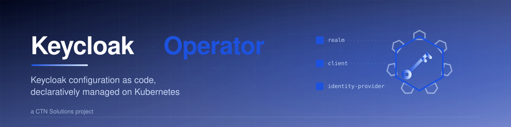

<div align="center">



[](https://github.com/ctn-solutions/keycloak-operator/actions/workflows/ci.yml)
[](https://github.com/ctn-solutions/keycloak-operator/actions/workflows/e2e.yml)
[](https://github.com/ctn-solutions/keycloak-operator/actions/workflows/codeql.yml)
[](https://github.com/ctn-solutions/keycloak-operator/security/scorecard)
[](https://github.com/ctn-solutions/keycloak-operator/releases)
[](LICENSE)
[](https://www.keycloak.org/)

</div>

A Kubernetes operator that manages [Keycloak](https://www.keycloak.org/) configuration
declaratively. Realms, clients, client scopes, roles, identity providers and groups live in
your Git repository; the operator keeps a Keycloak server in sync with them.

It maps the [Keycloak Admin API](https://www.keycloak.org/docs-api/latest/rest-api/) 1:1:
every field in a custom resource spec mirrors the corresponding field of the Keycloak
representation it manages, so what you write is exactly what the server stores.

```yaml
apiVersion: keycloak.ctn-solutions.io/v1alpha1
kind: Realm
metadata:
  name: acme
spec:
  keycloakRef:
    name: production
  realm: acme
  displayName: ACME Platform
  registrationAllowed: false
  accessTokenLifespan: 900
```

## Features

- **1:1 API mapping** — spec fields match the Keycloak representations field-for-field.
  Scalar fields are pointers, so *unset*, *explicitly false/zero* and *default* are always
  distinguishable.
- **Declarative field removal** — the operator records what it last applied; removing a
  field from a spec resets it on the server.
- **Drift correction** — changes made out-of-band in the Keycloak console are reverted on
  the next reconciliation (periodic resync, default 1h).
- **Adoption policies** — per-resource control over pre-existing server state:
  `CreateOnly` (default, never touches foreign resources), `Adopt` (take over),
  `FailIfExists`.
- **Protected realms** — `master` is refused unless a resource explicitly carries the
  `keycloak.ctn-solutions.io/allow-protected: "true"` annotation.
- **Safe deletion** — every resource carries a finalizer; realms are orphaned by default
  and only deleted with an explicit `deletionPolicy: Delete`.
- **Secrets in both directions** — client secrets, identity-provider credentials and SMTP
  passwords are read from Kubernetes Secrets (never inline in CRDs), and Keycloak-generated
  client secrets are exported to Secrets for applications to mount. Inline secrets in
  `smtpServer` / IdP `config` maps are **rejected by the API server** through CEL
  validation rules — no webhook required.
- **Multi-server** — one operator deployment manages any number of Keycloak servers through
  `KeycloakConnection` resources.

## Why trust it?

- **Every commit is validated end-to-end** against real Keycloak servers — the CI
  integration matrix runs the full suite on Keycloak 26.0, 26.1, 26.2 and 26.3 before
  anything ships, and releases are gated on the same matrix.
- **Verifiable supply chain** — images are multi-arch, built from a distroless base,
  signed with Sigstore cosign (keyless) and carry SBOM + build provenance attestations.
  Verify with the command in [SECURITY.md](SECURITY.md).
- **Secrets never touch your Git repository** — sensitive values are injected from
  Kubernetes Secrets at reconciliation time, and inline secrets are rejected by the API
  server itself.
- **Safe by default** — foreign resources are never touched (`CreateOnly`), realms are
  never deleted implicitly (`Orphan`), and `master` is locked behind an explicit
  annotation.

## Resource types

| CRD | Manages | Natural key |
|---|---|---|
| `KeycloakConnection` | A Keycloak server and its admin credentials | — |
| `Realm` | A realm (`RealmRepresentation`) | `spec.realm` |
| `Client` | A client (`ClientRepresentation`) | `spec.clientId` |
| `ClientScope` | A client scope (`ClientScopeRepresentation`) | `spec.name` |
| `RealmRole` | A realm role incl. composites (`RoleRepresentation`) | `spec.name` |
| `IdentityProvider` | An identity broker (`IdentityProviderRepresentation`) | `spec.alias` |
| `Group` | A group incl. role mappings (`GroupRepresentation`) | `spec.name` |

All resources live in the API group `keycloak.ctn-solutions.io/v1alpha1` and reference
their server through `spec.keycloakRef.name`, which must point to a `KeycloakConnection`
in the same namespace.

## Quickstart

Install the operator, then walk through the
[getting-started guide](docs/getting-started.md) — from zero to a managed
realm in about ten minutes, including a throwaway Keycloak server.

Install with Helm from the OCI registry (recommended):

```bash
helm install keycloak-operator oci://ghcr.io/ctn-solutions/charts/keycloak-operator \
  --namespace keycloak-operator-system --create-namespace
```

Or with the installer script (no Helm required):

```bash
curl -fsSL https://github.com/ctn-solutions/keycloak-operator/releases/latest/download/install.sh -o install.sh
bash install.sh install
```

Or via Homebrew (installs the installer as a CLI):

```bash
brew install ctn-solutions/tap/keycloak-operator
keycloak-operator install
```

Or without any tooling, as a single manifest:

```bash
kubectl apply -f https://github.com/ctn-solutions/keycloak-operator/releases/latest/download/install.yaml
```

**Namespace-scoped installs.** By default the operator watches all
namespaces and holds cluster-wide RBAC. To confine it to its own namespace
(Role/RoleBinding instead of ClusterRole, restricted cache):

```bash
helm install keycloak-operator charts/keycloak-operator \
  --namespace keycloak-operator-system --create-namespace \
  --set rbac.clusterScoped=false
```

> Helm installs the CRDs from the chart's `crds/` directory on install but never upgrades
> them. When upgrading the operator, apply the CRDs manually first:
> `kubectl apply -f charts/keycloak-operator/crds/`.

Point the operator at your Keycloak server and declare a realm:

```bash
kubectl create namespace keycloak-system
kubectl apply -f examples/
```

Watch it converge:

```bash
kubectl get realms,clients,groups -n keycloak-system -o wide
kubectl describe realm acme -n keycloak-system   # conditions and events
```

## Semantics

### Adoption policy (`spec.adoptionPolicy`)

| Policy | Resource exists, unmanaged | Resource exists, managed by us | Resource absent |
|---|---|---|---|
| `CreateOnly` *(default)* | Fail (`AlreadyExists`) | Resume managing | Create |
| `Adopt` | Take over and enforce | Resume managing | Create |
| `FailIfExists` | Fail | Fail | Create |

The operator stamps a managed marker on resources it creates or adopts (in the
representation's `attributes` where the API allows it). Identity providers have no
attributes block; there, management is tracked through the resource's last-applied
annotation.

### Deletion policy (`spec.deletionPolicy`)

| Kind | Default | On resource deletion |
|---|---|---|
| `Realm` | `Orphan` | Realm stays on the server |
| All others | `Delete` | Server resource is deleted |

Set `deletionPolicy: Delete` on a Realm to opt in to realm deletion.

### Status

Resources report standard conditions:

- `Ready` — the reconciliation outcome (`Succeeded`, `Retrying`, `Failed`, or reasons such
  as `ConnectionUnavailable`, `AlreadyExists`, `SecretMissing`, `ProtectedRealm`)
- `Synced` — the server state matches the spec

Transient errors (network, 5xx) retry with backoff. Terminal errors (conflicts, missing
secrets, protected realms) surface in the conditions and wait for a spec change or the
periodic resync.

### Secrets

Sensitive values never live in custom resources (the operator injects them from Secrets
at reconciliation time and never records them in status, events or annotations):

- `Client.spec.secretRef` — injects the client secret from a Secret you own.
- `Client.spec.secretOutput` — exports the effective client secret to a Secret owned by
  the `Client` resource, for applications to mount.
- `IdentityProvider.spec.configSecretRef` — injects broker config values (e.g.
  `clientSecret`) from a Secret.
- `Realm.spec.smtpServerSecretRef` — injects SMTP credentials.

## Security model

- The operator holds **cluster-wide Secret read access** (connection credentials may live
  in any namespace) and writes exported client secrets next to the resources that own
  them. Compromise of the operator's ServiceAccount exposes cluster Secrets — grant the
  `KeycloakConnection` and `Client` resources to trusted users only, or run the operator
  with a namespace-scoped RBAC setup if that trust boundary is too wide.
- `KeycloakConnection.spec.url` is a tenant-controlled outbound URL. The CRD schema
  restricts it to `http(s)://`, but creating connections should be limited to platform
  administrators to prevent use as an internal network probe.
- Exported client secrets (`secretOutput`) are created and owned by the operator; a
  pre-existing Secret with the same name is never overwritten — reconciliation fails with
  a clear condition instead.
- Container images run as non-root from a distroless base, are multi-arch
  (amd64/arm64), built with SBOM and SLSA build provenance attestations, and signed
  with [Sigstore cosign](https://github.com/sigstore/cosign) (keyless). Verify:

  ```bash
  cosign verify \
    --certificate-identity-regexp 'https://github.com/ctn-solutions/keycloak-operator/\.github/workflows/.*' \
    --certificate-oidc-issuer https://token.actions.githubusercontent.com \
    ghcr.io/ctn-solutions/keycloak-operator:<tag>
  ```
- CI runs lint, unit tests, end-to-end tests on kind, CodeQL, dependency review and the
  OpenSSF Scorecard on every change. See [SECURITY.md](SECURITY.md) for the reporting
  policy.

## Observability

The operator exposes custom Prometheus metrics on `:8443` alongside the
standard controller-runtime metrics:

| Metric | Type | What it tells you |
|---|---|---|
| `keycloak_operator_reconciliations_total` | counter | Reconciliations by kind and outcome (`success` / `error` / `terminal`) |
| `keycloak_operator_reconcile_duration_seconds` | histogram | Reconciliation latency by kind |
| `keycloak_operator_drift_corrections_total` | counter | Server-side updates issued to revert out-of-band changes |
| `keycloak_operator_connection_up` | gauge | `1` when the operator can authenticate against a connection |
| `keycloak_operator_server_info` | info gauge | Connected server version per connection |
| `keycloak_operator_admin_requests_total` | counter | Admin API requests by connection, method and status class |
| `keycloak_operator_admin_request_duration_seconds` | histogram | Admin API latency by connection and method |

The endpoint is authenticated and authorized by default; the chart ships an
optional Service and ServiceMonitor. See [docs/metrics.md](docs/metrics.md)
for the full reference, alerting queries and scraping setup.

## Compatibility

- Keycloak **26.x** (the Admin API paths and semantics are verified against 26.3).
- Kubernetes 1.25+.

## Development

```bash
make test          # unit + controller tests (envtest, no cluster needed)
make lint          # golangci-lint
make run           # run the operator against the current kubeconfig context
```

End-to-end tests against a real Keycloak 26 server on a local cluster:

```bash
bash test/e2e/e2e.sh
```

## Documentation

| Document | Contents |
|---|---|
| [Getting started](docs/getting-started.md) | Zero to a managed realm in ten minutes, with a throwaway Keycloak |
| [Installation](docs/installation.md) | Helm (OCI and local), plain manifest, namespace-scoped installs, uninstall |
| [CRD reference](docs/crd-reference.md) | Every field of every resource |
| [Metrics](docs/metrics.md) | Custom metrics, alerting queries, Prometheus scraping |
| [Troubleshooting](docs/troubleshooting.md) | Runbook for every `Ready=False` reason |
| [Troubleshooting](docs/troubleshooting.md) | Runbook for every `Ready=False` reason |
| [Upgrading](docs/upgrading.md) | Operator and CRD upgrades, compatibility matrix, rollbacks |
| [Release process](docs/release-process.md) | Versioning policy, release cadence, release checklist |
| [Design](docs/design.md) | Architecture and design decisions |
| [Chart values](charts/keycloak-operator/README.md) | Full Helm values reference and example profiles |

## Roadmap

- User management (with write-once, SecretRef-only credentials)
- Group sub-groups (hierarchical)
- Client authorization services
- Realm-level default groups and client policies

## License

[Apache-2.0](LICENSE)
